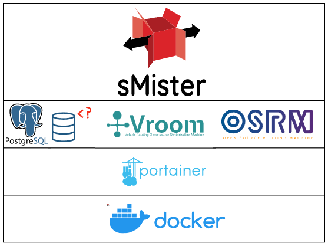

# sMister

## Struttura progetto

NB: gitignore su dockerservices: questa cartella serve solo come root per i servizi docker, è da aggiornare anche nei docker.

## Idea 

L'idea di sMister nasce dalla crescente necessità da parte delle aziende di sistemi automatizzati che rendano più veloce ed efficiente lo smistamento dei pacchi. Questo sistema permette ad un centro logistico di ottimizzare il processo di consegna calcolando i percorsi ottimali per i corrieri e gestendo il flusso dei pacchi dal magazzino fino al veicolo di consegna.

Obiettivi del progetto

- Ottimizzare i percorsi dei corrieri per migliorare l'efficienza delle consegne
- Ridurre al minimo l'intervento umano nella gestione dei pacchi
- Realizzare un sistema facilmente replicabile e scalabile
- Limitare la dipendenza da servizi di terze parti

## Tecnologie

### Hardware

Per quanto riguarda la piattaforma hardware, si è scelto di utilizzare un Raspberry Pi 5 ovvero un single board computer sufficientemente prestante da supportare un sistema operativo e dotato di pin GPIO utili per il collegamento di componenti esterni. 

La lettura dei codici identificativi dei pacchi viene eseguita da una telecamera USB, mentre l'hardware per lo smistamento fisico dei pacchi è stato collegato tramite l'interfaccia GPIO.

La componentistica utilizzata è:

- motore stepper: attiva il nastro trasportatore 
- sensore ad ultrasuoni SR04: rileva il passaggio del pacco davanti alla postazione di smistamento relativa alla baia di carico
- motore stepper: attiva il diverter che devia il pacco verso la zona del veicolo per la consegna

Per motivi di costo si è deciso di non utilizzare telecamere davanti ad ogni postazione di smistamento e di utilizzare dei sensori ad ultrasuoni che sono più economici e facili da reperire. Sensori laser sarebbero stati equivalenti, tuttavia non erano disponibili al momento dell'assemblaggio.

TODO: COMPLETARE SPECIFICHE HARDWARE

### Software

Il core del progetto è stato sviluppato in Python. Questo linguaggio è stato scelto per via della sua facilità di prototipazione e dell'ampia disponibilità di librerie.

Per garantire un approccio modulare e flessibile sono state sviluppate due librerie custom: `vroom_utils` e `conveyoryeeter`.

Vroom_utils è la libreria che astrae la comunicazione con i servizi di routing. Funge da interfaccia per le componenti principali di Vroom, come `job` e `vehicle`,e viene usata per generare le richieste con metodi ad alto livello che rendono il codice principale più leggibile.

Conveyoryeeter è la libreria che si occupa di astrarre a livello software i componenti hardware del sistema di smistamento. Le periferiche hardware come i sensori ad ultrasuoni, il motore del nastro trasportatore e i motori per i diverter sono gestiti tutti da questa libreria. Ogni stazione è composta da un sensore di rilevazione del pacco e da un diverter. Grazie ad uno stato stato interno il sistema è in grado di capire, al passaggio di un pacco, se questo deve essere deviato verso la relativa baia di carico o se deve essere lasciato passare.

### Servizi

Parte fondamentale del progetto sono i servizi Docker che permettono al sistema di essere facilmente configurabile e integrabile in vari ambienti grazie a vari servizi Docker installati in locale. Sono stati usati i seguenti servizi:

- Portainer: interfaccia grafica web che permette l'installazione di container in maniera semplificata
- Postgres: il database che contiene le informazioni relative ai pacchi
- Adminer: programma che serve per gestire da un interfaccia grafica Postgres
- VROOM: servizio che fornisce un sistema di routing ottimale
- OSRM: motore open source per il calcolo di percorsi stradali

I servizi sono stati organizzati in stack dedicati, in modo da raggruppare componenti funzionalmente simili.

## Funzionamento

sMister interroga il database per ottenere l'elenco delle consegne previste e riceve come risposta gli indirizzi dei colli associati. Queste informazioni sono trasformate in jobs, ovvero lavori di consegna da effettuare e, in base alla flotta di veicoli per le consegne disponibili, delega a VROOM il calcolo dei percorsi ottimali per ogni veicolo. 

Una volta calcolato ciò, il sistema deve riconoscere l'id del pacco su un nastro trasportatore per indirizzarlo verso la baia di carico corretta: questo viene fatto tramite un codice a barre che identifica unicamente ogni pacco. Lungo la linea alcuni attuatori si occupano di consegnare alla zona di carico giusta ogni pacco.

### Fasi 

Il sistema funziona in varie fasi separate e sequenziali.

#### Requisiti

I requisiti perché il sistema possa funzionare sono quelli di avere una connessione ad un database con le informazioni riguardanti i pacchi presenti in magazzino. È necessario che ogni pacco abbia un codice univoco, un indirizzo di spedizione e uno stato che indica se il pacco sia ancora da consegnare o meno (ritiri in sede, consegne mancate, ...). 

#### Fase 1

Una volta avvenuta la connessione al database, _sMister_ lo interroga richiedendo i pacchi con il flag specifico per la consegna in data odierna. 

#### Fase 2

Utilizzando i dati ricevuti nella fase precedente, il sistema ricava le coordinate geografiche delle consegne e, in base ai veicoli disponibili, compone un messaggio per il servizio di routing _VROOM_ utilizzando la libreria `vroom_utils`.

#### Fase 3

Il messaggio generato durante la fase precedente viene inviato al servizio di routing in locale. Quest'ultimo risponde con un messaggio contente le informazioni relative al percorso di ogni veicolo per le consegne in base ai pacchi che gli sono stati assegnati. Queste informazioni vengono lette e salvate nel database in modo da essere usate nella fase fase successiva.

#### Fase 4

L'ultima fase prevede lo smistamento fisico dei pacchi tramite un nastro trasportatore. Il motore del sistema di smistamento vien e attivato e i pacchi cominciano a scorrere davanti alla fotocamera che ne legge l'id e, grazie alla libreria `conveyoryeeter`, comunica alle postazioni in modo che sappiano come gestire un pacco che passerà loro davanti. Nel mentre le postazioni scannerizzano l'area antistante per rilevare il passaggio di un pacco. Tramite un complicato sistema di specchi e leve, sono in grado di decidere se ignorare il pacco o spingerlo verso la baia di carico.

